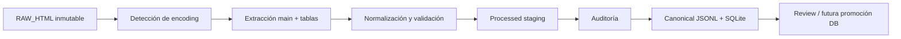

# Ingestión V3.1

El pipeline es local y reproducible. Nunca descarga Serebii ni modifica `data/source/snapshots/20260809/Pokopia-KB-FULL`.



## Comandos

Desde la raíz:

```bash
npm run data:process
npm run data:validate
npm run data:audit
```

`data:process` y `data:audit` reconstruyen el conjunto y la auditoría completa; `data:validate` sólo verifica los artefactos existentes, integridad SQLite, claves foráneas, recuentos, fuentes, encoding y hashes.

## Contrato de salida

- `data/processed/v3.1/pages/**`: JSON normalizado por página.
- `data/processed/v3.1/markdown/**`: Markdown limpio por página.
- `data/processed/v3.1/manifest.json`: manifiesto de ejecución.
- `data/canonical/v3.1/pages.jsonl`: documentos fuente normalizados.
- `data/canonical/v3.1/entities.jsonl`: entidades documentales/enlazadas.
- `data/canonical/v3.1/relationships.jsonl`: relaciones explícitas `links_to`.
- `data/canonical/v3.1/facts.jsonl`: pares key/value conservadores con coordenadas de tabla.
- `data/canonical/v3.1/rag.jsonl`: chunks limpios con hash, URL y versión de parser.
- `data/canonical/v3.1/pokopia-canonical.sqlite`: las mismas capas, tablas/celdas y FTS5.
- `data/audits/v3.1/audit.json`: auditoría legible por máquina.

Los artefactos derivados están ignorados por Git. No representan todavía una promoción a la base de producción: son staging trazable para revisión.

## Invariantes

- TypeScript estricto; ningún `any` explícito.
- Cada página conserva URL, SHA-256, `fetched_at`, `processed_at` y versión del parser.
- Cero U+FFFD/mojibake como gate de validación.
- Ninguna página corta se acepta silenciosamente: se etiqueta `short` y se reporta.
- Las relaciones se derivan únicamente de enlaces presentes; los facts, de filas exactamente key/value.
- La selección de índices de tabla se contrasta con `TABLES` legado (declarado fiable), pero celdas, Unicode, enlaces y spans se vuelven a extraer desde RAW_HTML.
- Un nuevo snapshot debe vivir bajo una nueva carpeta fechada. Comparar manifiestos, hashes y entidades antes de promoverlo; no sobrescribir historia.

## Extensión incremental

Para una actualización futura, parametrizar la carpeta de snapshot y comparar `source_url + source_hash` entre manifiestos permite clasificar páginas nuevas, eliminadas y modificadas. Los diffs de entidades/facts deben revisarse antes de la promoción canónica; una desaparición nunca se interpreta automáticamente como borrado válido.
