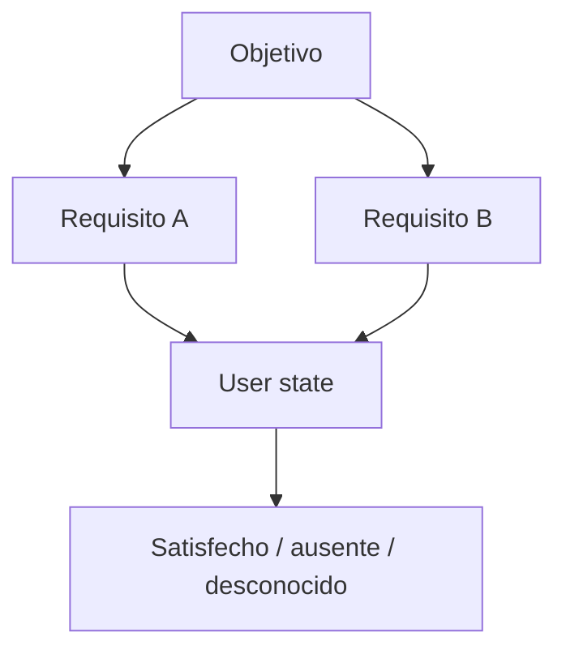

# Rule y dependency engine

`@pokopia/rules` mantiene dependencias separadas del estado del usuario. Un requisito tiene identificador, etiqueta y dependencias. El estado admite `user_confirmed`, `inferred` y `unknown`; la ausencia siempre se interpreta como `unknown`, nunca como completado.

El motor actual valida ciclos, produce orden topológico y calcula requisitos ausentes. Es deliberadamente pequeño: no ejecuta texto ni código almacenado en base de datos.

La siguiente fase debe conectar nodos a IDs canónicos versionados, conservar evidencia de cada arista y distinguir prerrequisito lógico de mera recomendación.
