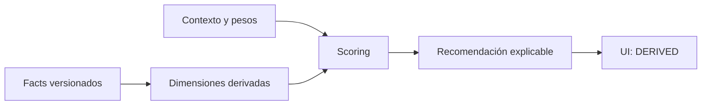

# Scoring y recomendaciones

## Iteration 3.5

La ordenación individual no usa marginalidad. El modo equipo ordena primero por ganancia marginal y después por score, capacidad y evidencia. `dataCoverage`, `evidenceQualityScore` y `confidenceScore` son señales distintas; los empates se publican explícitamente.

El scoring es una capa derivada. No se almacena ni presenta como un hecho del juego.

## Contrato actual

`@pokopia/scoring` recibe Pokémon ya normalizados y un contexto. La primera versión usa tres dimensiones explicables:

| Dimensión          | Peso | Evidencia                                                                                          |
| ------------------ | ---: | -------------------------------------------------------------------------------------------------- |
| `specialty_match`  | 0,70 | coincidencia textual directa con la especialidad estructurada                                      |
| `habitat_match`    | 0,20 | coincidencia textual directa con el hábitat ideal                                                  |
| `evidence_quality` | 0,10 | presencia de especialidad en tabla estructurada; el snapshot legacy vale 0,5 por no estar revisado |

`score = round(100 × Σ(valor × peso))`

Cada resultado devuelve las contribuciones y una explicación. Si ningún dato coincide, la interfaz muestra `NEEDS TESTING` y no fabrica una lista.

## Evolución prevista

Los pesos pasarán a configuración versionada en PostgreSQL. Se añadirán utilidad, exclusividad, frecuencia, automatización, coste de oportunidad, sinergia, compatibilidad de pueblo, progresión y endgame cuando existan facts canónicos para alimentarlos. Un cambio de pesos debe conservar autor, versión y fecha.

## Separación de capas

